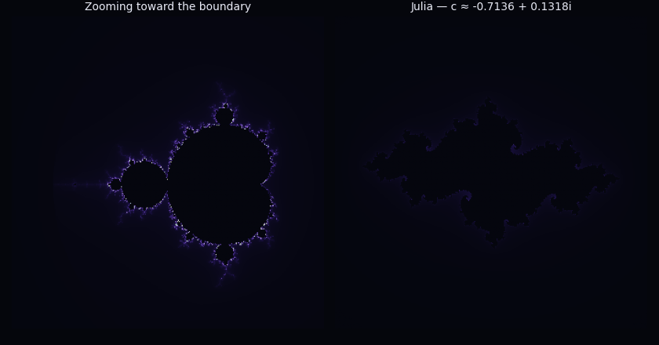

# Fractal Observatory

An interactive Mandelbrot Set explorer with a linked, live-updating Julia Set —
move the cursor over the Mandelbrot set and watch the Julia set on the right
redraw in real time for whatever point (c) you're hovering over. Built to go
beyond a static render: smooth color gradients, mouse-driven zoom, and an
animated zoom sequence are all included.

## Fractal type(s) implemented

- **Mandelbrot Set** — `z → z² + c`, rendered with smooth (renormalized)
  escape-time coloring to avoid banding.
- **Julia Set** — same iteration, run for a fixed `c` instead of a fixed `z₀`.
  The two are combined into one interactive piece: every pixel you hover on
  the Mandelbrot set is the `c` used to render the Julia set beside it, which
  is the actual mathematical relationship between the two fractals.

## Tools, languages, and libraries used

- **Python 3**
- **NumPy** — vectorized escape-time computation over the whole pixel grid
- **Matplotlib** — rendering, custom colormap, GUI event handling (scroll /
  mouse-move / click / key-press) for the interactive explorer, and
  `FuncAnimation` for the zoom GIF
- **Pillow** — GIF encoding backend for the animation


## Setup and run instructions

```bash
git clone https://github.com/b1lquees/Fractal-Pattern-Shirt-AI-.git
cd Fractal Pattern Shirt AI 
pip install -r requirements.txt
```

**Shirt Generation**
python shirtmockup.py

**Interactive explorer** (needs a local display / GUI backend):

```bash
python fractal_observatory.py
```

- Scroll on the left panel to zoom in/out, centered on the cursor
- Move the mouse over the left panel to drive the Julia set on the right
- Click the left panel to lock/unlock the current Julia point
- Press `r` to reset the view

**Headless renderer** (no display needed — writes `hero.png` and `zoom.gif`):

```bash
python render_preview.py
```

## Output

**Mandelbrot (full view + zoomed filament) and its matching Julia set:**

 


**Zooming toward the boundary, Julia set updating alongside:**



## Author

- **Name:** Bilquees Ashfaq Jumani
- **Registration number:** 559015
